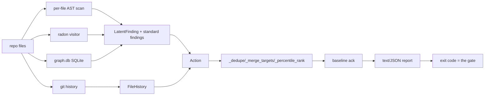

# TECHSPEC — lucidlint: the deterministic lucidlint gate

How the product in `docs/PRD.md` is built. Requirements by name: R1–R20
(references are to requirement numbers in the PRD).

## Component breakdown

| Component | Responsibility | Provides | Consumes |
|---|---|---|---|
| `lucidlint.py` | the gate: scan → findings → actions → report | `lucidlint` module (CLI + testable functions) | radon (optional), the repo's `.code-review-graph/graph.db`, git history, `check_records.py` |
| `check_records.py` | record-vs-bare-dict gate (stdlib AST) | `scan(paths) -> ScanResult` | repo `.py` files |
| `check_review_posted.py` | PR review-attribution gate | exit code for CI | GitHub API via env creds |
| `tests/` | fake-based unit suite for lucidlint + check_records (`tests/fixtures/`) | 130+ tests | fakes only — never real radon/repos/git |
| `docs/` | PRD (requirements), TECHSPEC (this), PLAN (phases) | — | — |

## Object model (the naming authority — classes are these nouns)

- **`Action`** — one finding: kind, severity (fail/warn/ack), file, line,
  function, message, metric, churn, last_modified, tested, note, raw,
  priority, in_diff, kinds (merged), callers. The wire format is produced at
  the render boundary (`asdict`), never claimed as a type. Severity: "fail"
  (blocks the gate), "warn" (reported, never fails — carries the noisy
  signals), "ack" (locked in the baseline).
- **`LatentFinding`** — one unextracted-class/stdandard signal (signal,
  function, line, metric, detail, severity) before it becomes an Action;
  severity defaults to "fail", warn checks set "warn".
- **`FunctionRecord`** — (rel, name, line, skeleton) for the duplication
  search; the skeleton collapses names/constants/args to placeholders so
  copy-paste with renames keeps its shape.
- **`DuplicateMatch`** — a later function ≥ 90% structurally similar
  (Dice similarity on skeleton bigrams, length-bucketed pairs).
- **`ReferenceScan`** — one unused-function pass: module-level definitions,
  every referenced name, and all string literals (CLI dispatch).
- **`ClassRef`** — a class identified by its defining file and name (frozen;
  the tuple-alias lesson: two fields with distinct meanings, never
  `ClassKey = tuple[str, str]`).
- **`ImportedSymbol`** — an imported symbol's dotted module and original name.
- **`ClassScan`** — one repo-wide class pass: registry, per-module import
  maps, class list.
- **`NodeInfo`** — graph node facts for one function (tested, signature,
  span, def_sig).
- **`Cluster` / `Clusters`** — resolved callee subsystems (name, count,
  callees) and the evidence verdict (strong, unresolved).
- **`CoverageResult` / `CoverageContext`** — covered lines + source;
  provenance label + staleness verdict.
- **`FileHistory`** — per-file churn and last-modified.
- **`GitHead`, `Callers`, `VolatilePart`, `NameGroups`, `MethodFields`,
  `CoverageLines`, `ImportAliases`** — named result and map types; the maps
  are named by meaning, never `SomethingDict`.
- **`_RadonProvider`** — the lazily-loaded radon services object; tests
  inject a fake via `.visitor` (the standard's one-global-services-object
  pattern, not a `global`).

## Architecture

The pipeline is deterministic end-to-end (R1, R3): AST rules, graph edges,
git churn, radon — no model judgment; the review layer (PR-Agent / review
loop) is separate and only handles what code cannot check (the standard's
"deterministic checks beat model judgment" principle).

Severity (R24): per-file findings carry fail or warn; `_dedupe_merge`
merges per target and a warn merged into a fail target stays fail; the gate
counts only fail actions, warns render with a `[warn]` tag and a
"never-fail" verdict note, and `--update-baseline` writes only non-warn
keys — nothing noisy needs acknowledging to go green.

Factory functions: `complexity_actions`, `graph_actions`
(`_large_function_actions`, `_hub_file_actions`, `_high_risk_actions`),
`hotspot_actions`, `_record_actions`, `_latent_class_actions`
(`_scan_file` + `_closure_findings`/`_partition_findings`/
`_vague_name_findings`/`_standard_findings`), `_abstraction_actions`
(`_collect_classes`/`_concrete_counts`), `_docs_actions`
(`_docs_reachability_actions`), `_duplicate_actions`
(`_collect_functions`/`_first_duplicate`/`_fn_skeleton`/`_dice_similarity`),
`_unused_actions` (`_collect_references`/`_collect_file_references`,
`_referenced_anywhere` removed — prod/test reference split). The standard
family's warn checks are `_magic_number_findings` (operand/index/
call-arg literals outside (0, 1, 2, -1); all-literal containers pass) and
`_broad_except_findings` (non-empty `except Exception`/`BaseException`
handlers — empty/bare ones are already fail-tier). `_handler_swallows` is
exact: bare, or a body with no raise/return/break/continue — an explicit
return (even None or an empty literal) surfaces the contract, a continue
is retry semantics, and `_mutates_returned` treats a handler that stores
into or mutates a name the enclosing function returns (accumulator
pattern) as surfacing too. `_noop_statement_findings` flags expression
statements that discard their value (non-Call/Constant/Await/Yield/Lambda/
NamedExpr). `_all_constant`/`_container_all_constant` treat UnaryOp
constants (`-4.0`) as literals. `_kind_counts` renders the per-kind
roll-up line. In check_records, `record_literal_lines` skips dicts with
spread keys (`**` — None-key on 3.14, DictUnpack on 3.5-3.13), and
`_is_constant_value` handles UnaryOp constants. `ReferenceScan` splits `prod_references` vs
`test_references`: decorated module functions are registered by their
decorator, and a function referenced only from tests is a conditional
test-seam finding. `_global_state_findings` covers typed AnnAssign
literals and `_mutation_findings` catches module collections mutated
inside functions. `_hub_edge_counts` excludes CALLS to true builtins.
`_dedupe_merge` ranks by
churn × complexity × fan-in (R8); `_suppressions` reads
`# lucidlint: ignore <signal> <why>` exemptions via tokenize COMMENT
tokens (R17, R18).

## Technology choices

| Choice | Why | Rejected |
|---|---|---|
| stdlib only + radon via `uv run --with radon` | the tool must run anywhere; radon is the one optional dep, loaded lazily through `_RadonProvider` | full dependency tree, vendored radon |
| code-review-graph SQLite read directly | the graph is already built per repo (`.code-review-graph/graph.db`); sqlite3 is stdlib; no MCP dependency in the scan | querying via the MCP server |
| `tokenize` for comment-based rules (`type: ignore`, suppressions) | only real COMMENT tokens count — string/docstring text can never fire a finding (false-positive class eliminated) | line-regex scans |
| `unittest`/pytest with fakes (Env context manager, FakeRadonVisitor, FakeSubprocess, real SQLite with fake data) | the house testing standard: inject, never monkeypatch; fakes are objects | mock.patch/monkeypatch fixtures |

## Strategic technical decisions (requirement references)

- **D5 — facts + conditional guidance; never assert intent.** R1/R7. Each
  message states the evidence (names, counts, churn, field access) and
  offers "if this is the situation, do that" guidance; nothing is asserted
  the tool cannot know (no deletion advice, no one-off claims, no
  class-vs-coincidence verdicts).
- **D6 — coverage truth and staleness.** R6. Test status comes from the
  repo's own data (coverage.xml, then `.coverage`); a file absent from the
  snapshot is UNKNOWN, never uncovered; a stale snapshot flips the verdict
  to "verify", and hard "write the failing tests first" never fires on
  stale data.
- **D7 — the tool passes itself.** R15. Self-run must be GATE: PASS, and
  the tool's own code is the exemplar of every rule it enforces
  (ClassRef not ClassKey; RADON services object not `global`; suppressions
  with whys on its own safe-to-ignore excepts).

## Spikes required to confirm

None outstanding — the R14/R19/R20 detections were proven on houses during
the week of 2026-08-14 (9 latent-class findings including the
`_money`/`_penalty` closures; 123 standard findings; 1 docs finding).